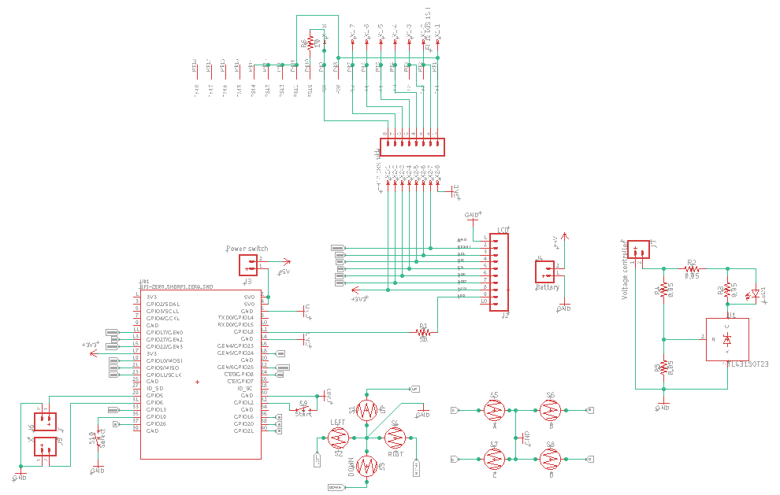
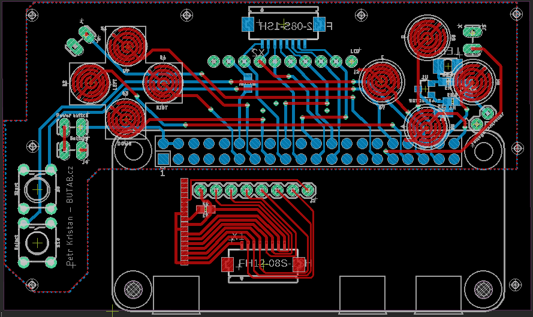

# PiBoy
Development of gameboy based on Raspberry Pi zero W with operation system Retropie.

## Design of PCB
PCB was design in Eagle and all neccassary files can be found in Eagle folder. According the design after the assebley I have discovered that the position of wires is not optimal, because they overlap with speaker in printed case. The PCB must be cut around around ground. The design also contains special board for LCD (need to be cut and will use separately). 

Charging board is not part of design. I have decided to buy charging board for Lithium batteries (approximately 2 dolars) and Boost Step Up converter (approximately 2 dolars). Raspberry Pie can work without step up converter, but you will not use full capacity of battery. The issue is that the battery has voltage from 3.7 to 4.2 V in dependence on state of charge of battery. Optimal voltage for RPI Zero is 5V, but it works from approximately 4 V. I had decided to use step up converter. The capacity of battery was limited by the size of battery. It has to fit into aluminium case with the rest of cirquits. 

Also the switch was connected outside of board and it was glued into front part of case. You need to put the switch on plus (+) of input voltage for RPI Zero.

Moreover left and right  rear buttons are also placed outside board and the are connected with board by thin flexible wires.

If you succesfully solder everything together I can recommend you to cover bottom part of board and raspberry by ducktape (isolation).

Cirquit:

Board:

## Design of case
Everything is placed in aluminium Altoid box. Plastic parts were printed by my friend and it was designed for the project mintyPi. Buttons can be also printed or you can buy them on Aliexpress. Plastic holder parts are glued with aluminum box. Board with Raspberry Pi are joined by screws.

## LCD screen
I have decided for 2.8 inches big lcd screen with resolution 320x240px. We need to remove back board and directly solder the flexible wire on supporting board that is part of designed PCB and need to be cut from PCB.

## Soldering
You need to buy RPi Zero without connector. You have to solder board and RPi Zero together that was the most difficult part. Please use flexible thin wires and do not use long wires. In case of long wires you will not be able to put it together, because limited space in box.

## Finish
If you are lucky you will see something like this.

## Configuration of Retropie
It is strongly recommended to configure static IP adress on device. You can find it here (Setting Static IP):
https://www.instructables.com/Make-Joystic-for-Retropie/

How to configure buttons:
https://learn.adafruit.com/retro-gaming-with-raspberry-pi/adding-controls-hardware?view=all
https://github.com/adafruit/Adafruit-Retrogame
https://learn.adafruit.com/retro-gaming-with-raspberry-pi/configuring-retrogame

How to set LCD:
https://sudomod.com/forum/viewtopic.php?t=2312

Retropie:
https://retropie.org.uk/
